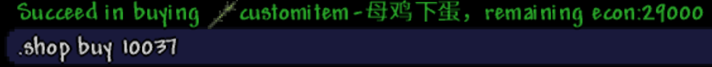
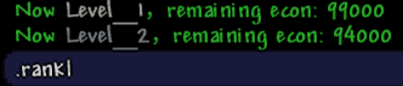
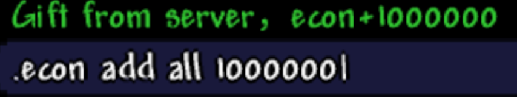
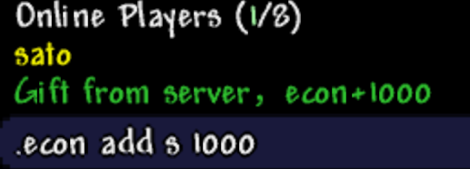
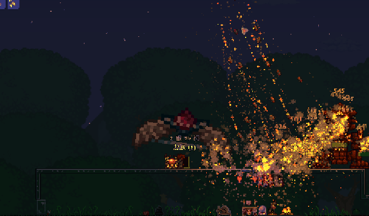

# CustomItemShop
A TShock plugin includes Econ, Rank and Shop with custom items

# How-to
Download release zip. <br />
Put all <code>.dll</code> files in TShock/ServerPlaugins path. <br />
Put all <code>.json</code> files in TShock/tshock path. <br />
The AutoReload.dll in release zip is not a part of the CustomItemShop plugin, but it will save you from excuting /reload when a json file is changed. <br />

# Command
command: <code>shop</code> <br />
- sub-command: <code>list</code> <br />
- sub-command: <code>buy</code> <br />

command: <code>rank</code> <br />

command: <code>request</code> <br />
alias:<code>req</code> <br />

command: <code>econ</code> <br />
- sub-command: <code>add</code> 
  - parameters: <code>all</code> <code>value</code> <br />
  - parameters: <code>player's name</code> <code>value</code> <br />
  
# Sample






# CustomItemSample

origin CustomItem repository is <a href= "https://github.com/Interverse/CustomItems">here</a>

# Shop.json Config Sample
```jsonc
  {
    "Item": 29, //the item id in terraria, you can get it from https://terraria.wiki.gg/wiki/Item_IDs
    "Rank": 2, //purchase rank limit
    "Text": "LifeCrystal", //text shown in 'shop list' command
    "Amount": 3, //the amount of the item
    "Price": 30000 //econ price
  },
  {
    "Item": 10003, //choose a unique integer number which is bigger than 10000 for customitem
    "Rank": 10, //purchase rank limit
    "Text": "customitem-精准打击", //the text for customitem must include 'customitem'
    "Amount": 1, //the amount of the customitem
    "Price": 500000 //econ price
  },
```
# shop_customitem.json Config Sample
```jsonc
  {
    "Item": 10003, //match a shop item in shop.json
    "ItemID": 3029, //the item shoot AI and img of the item whose terraria item id is 3029 will be used as a placeholder in game, in this situation 3029 is Daedalus Stormbow
    "Damage": 500, //the damage of the 
    "Shoot": 930, //the new projectile id of item 3029 in this case 
    "KnockBack": 12, //the new knockback value of item 3029 or the projectile 930
    "UseTime": 5, // the time of the use interval
    "ShootSpeed": 50, //the speed of the new projectile
    "Scale": 5, //the item img scaling ratio, bigger than 1
    "UseAmmo": 0, //whether use ammo, 0 or 1
    "Ammo": 0, // use which ammo, you can see the values available in terraria source code
    "UseAnimation": 15 //the item 3029's field in terraria source code. In my case, everthing seem ok if i set the value to 15 or 10
  },
```
